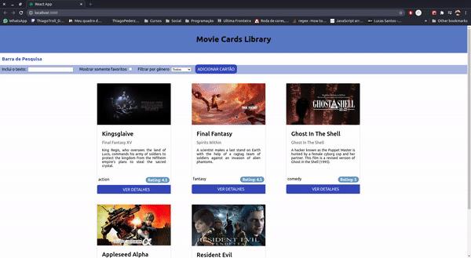

<h1 align="center">
  
</h1>
<h1 align="center">
  Projeto Movie Card Library CRUD
</h1>
<h2>Índice</h2>
<ul>
<li><a href="#sobre">Sobre</a></li>
<li><a href="#dev">Desenvolvimento</a></li>
<li><a href="#tech">Tecnologias</a></li>
</ul>

---

<h2 id="sobre">Sobre</h2>

O Movie Card Library CRUD é o projeto de avaliação do Bloco 13 de conteúdo da <a href="https://www.betrybe.com/" target="_blank"><em><strong>Trybe</em></strong></a>.

Ele é a evolução dos outros dois primeiros projetos referentes a introdução no módulo Front-end, onde o primeiro foi o do Bloco 11, Movie Card Library que tinha como objetivo a compreensão do básico de React como criação de componentes e fluxo entre eles.

Já o segundo projeto, referente a avaliação do Bloco 11, era o Movie Card Library Stateful, que tinha como principal objetivo a compreensão dos estados em React, principalmente em componentes criados através de classes, o que é JSX.

Nesse segundo projeto, o foco se deu no desenvolvimento de uma SearchBar, para entendermos bem os conceitos de estados e aprendermos sobre o fluxo de estados entre componente pai e filho.

O Movie Card Library CRUD tem por objetivo desenvolver uma aplicação que seja possível aplicar o conceito de CRUD = Create, Read, Update, Delete. O conteúdo do Bloco 13 refere-se aos ciclos de vida de um componente e ao React Router Dom, então nosso objetivo era através da estruturação dessas rotas criar formulários para adicionar novos filmes ao banco de dados, atualizar algumas informações, também poder ver detalhes sobre algum filme específico ou deletá-lo do banco de dados.

---

<h2 id="dev">Desenvolvimento.</h2>

A primeira etapa do projeto foi desenvovler as rotas para MovieList, MovieDetails, NewMovie, EditMovie e NotFound.

Depois deveria ser criada a renderização de MovieList, realizando uma requisição para buscar a lista de filmes com a opção de ver detalhes de cada um deles. Essa requisição deveria ser realizada no momento em que o componente era montado. Também deveria existir um botão adicionar filmes que direciona a pessoa usuária para a página NewMovie que renderiza um formulário com os campos vazios para informações sobre o novo filme.

Cada filme renderizado em MovieList era o retorno da renderização de um MovieCard, que deveria apresentar as informações sobre o filme.

Quando clicado no botão ver detalhes, a pessoa usuária é direcionada para a MovieDetails, que renderiza as informações do filme selecionado e apresenta três botôes: para voltar para a página inicial, para ser direcionado para a página de edição e um terceiro que deleta o filme do banco de dados e redireciona a pessoa usuária para a página inicial.

Se a pessoa usuária clicar no botão de editar, ela é direcionada para a página EditMovie e encontra um formulário com os campos preenchidos com as informações atuais acerca daquele filme, podendo ela apagar essas informações, adicionar novas e clicar no botão para salvar essas alterações.

<h3>Minhas implementações no projeto</h3>

 Acrescentei toda estilização das páginas, assim como a substituição do texto "Loading..." pelo efeito da Fita VHS enquanto carrega de uma página para outra.

Para me auxiliar na estilização em relação a composição de cores, utilizei o site <a href="https://mago-iris.vercel.app/" target="_blank"><em>Paleta de Cores</em></a> desenvolvido pelo <a href="https://www.linkedin.com/in/williammago/" target="_blank"><strong>William Gonçalves</strong></a>.

A imagem da fita foi retirada do <a href="https://unsplash.com/photos/OhPQta-BIhw" target="_blank"><em>Unsplash</em></a> e pertence ao <strong>Morgan Vander Hart</strong>.

Importei a feature do SearchBar, corrigindo o código para que funcionasse com essa nova forma de buscar os dados que esse projeto proporciona.

Adicionei a opção de voltar quando a pessoa usuária está no formulário de adicionar novo filme ou editar um filme, caso queira desistir de alguma dessas ações.

---

<h2 id="tech">Tecnologias utilizadas.</h2>

<ul>
<li>React</li>
<li>React-Router-Dom</li>
<li>Proptypes</li>
</ul>

---

<h1 align="center">
  
</h1>

Desenvolvido por © Thiago Pederzolli Machado da Silva!

